# CRM-System

## Project Vision Statement
I would like to develop a CRM system that provides the ability to easily manage customer data, items, special offers and purchases for free. 

## Project glossary

### Customer

A customer is a person who buys or has bought products from the application user. Street, house number, postal code, city, email address, phone number and purchases are recorded about him. Each customer has a consecutive id. 

### Item

An item is a product that the user offers for sale. It has a sequential id, a name and a base price. In addition, the number of available pieces is collected. 

### Special offer

A special offer is an offer in which a certain item is offered in a fixed quantity at a fixed, lower price. Each offer has its own ID. It is valid only for a certain time. 

### Purchase 

A purchase is a product that a customer wants to buy at a fixed time in a fixed quantity. It consists of a consecutive order number, the date, the customer, the item and the quantity. The price is the best price by using special offers. 

## Use-Case-Diagram
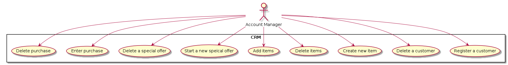

## User Stories

### Register a customer

As an account manager, I would like to be able to insert and edit new customers. 

I am logged in. I click on "Customers" in the navigation bar and get to a page where all customers are displayed. At each customer is a button with a pen. If I click on it, I will be able to edit the customer. If I click on the button with the "+" above the table, I can create a new customer. In both cases a form field appears where I can enter the data. When editing an already existing customer, his old data is entered there. If I click on the "Save" button below the form, the data is saved and I see the updated table. When I click the "Cancel" button, however, the change is discarded. 

### Delete a customer

As an account manager, I would like to delete customers that are no longer needed. 

When I am logged in, I click on "Customers" in the navigation. There I see an overview of all my customers. If I click on the button with the trash can for a customer, the customer is deleted and I see the updated table. However, if there are still purchases of the customer (open), the deletion of the customer is not possible and an error message appears. 

### Create new item

As an account manager, I want to create a new item. 

When I am logged in, I click on "Articles" and get to a page where all items are listed with the corresponding information. By clicking on the pencil next to an item, I can edit the article. By clicking on the plus sign above the table I can create a new item. In both cases a form appears where I enter the description, the basic price in Euro and the quantity. When editing an existing item, the old data is entered there at the beginning. By clicking on "Save" I save the changes and see the updated table. When I click the "Cancel" button, however, the change is discarded. 

### Delete items

As an account manager, I would like to delete items from the database. 

When I am logged in, I click on "Items" and get to a table with all items. When I click on the trash can button for a particular item, the item is deleted along with associated special offers and I see the updated table. In the associated purchases as item will be shown "Unknown".  

### Add items
As an account manager, I would like to increase the quantity of an item. 

When I am logged in, I click on "Items" and get to a page with the list of all items. If I click on the plus sign for a certain item, a text field appears there where I can enter the number of pieces added. If I click on the button with the checkmark next to it, the number of pieces is updated. At the beginning, the text field contains the value 0, so that if I accidentally press the plus button, I can simply save without adding new pieces. 

### Start a new special offer
As an account manager, I want to launch special offers. 

When I am logged in, I click on "Special offers" and see a list with all special offers. If I click on the pencil next to a special offer, I can edit it. If I click on the plus sign above the table, I can create a new special offer. In both cases a form appears where I can select the item and enter quantity and total price. When I edit an already existing special offer, the old data is selected and the offer must be cheaper than buying the products separately. With "Save" the changes are saved and the recent date is used, with "Cancel" discarded". After that the current table is displayed.  

### Delete a special offer
As an account manager, I want to delete a special offer.

When I am logged in, I click on "Special offers" and see a list with all special offers. If I click on the trash next to a special offer, the special offer is deleted and the updated table is shown. However, if I want to delete an offer that has not yet expired, an error message appears instead. 

### Enter purchase
As an account manager, I would like to enter a new purchase. 

When I am logged in and click on "Purchases", I get a list with all purchases. If I click on the plus sign, a form opens. There I can select customers and items. I can also specify the quantity, but it must not be greater than the stock. When I click on "Save", the purchase is inserted with the current date and the stock of the products is reduced according to the quantity. If I click on "Cancel", the changes are discarded. After that I see the current table. 

### Delete purchase
As a customer service representative, I would like to delete an order. 

When I am logged in and click on "Orders", I see a list of all orders. If I now click on the trash can next to an order, the order is deleted and the table is updated. However, this has no effect on the quantity of the item. 

## Domain model
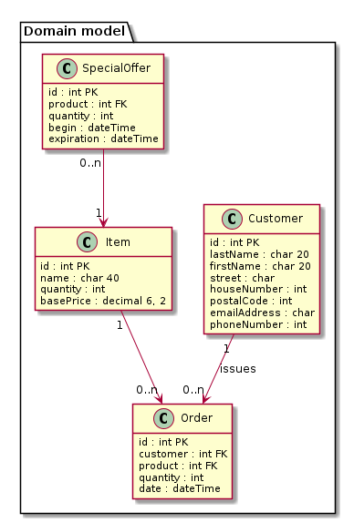

## Activity diagrams

### Register a customer
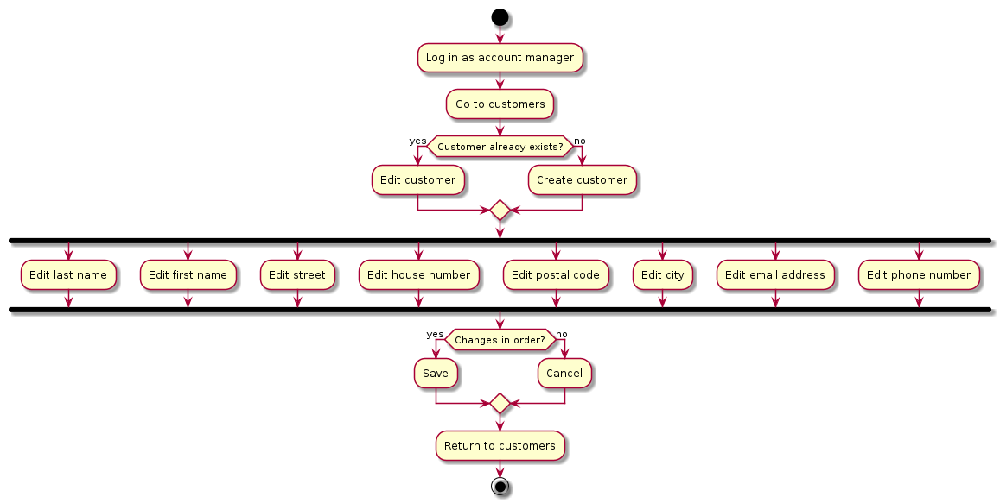

### Delete a customer
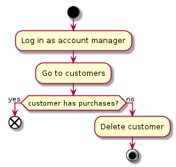

### Create new item
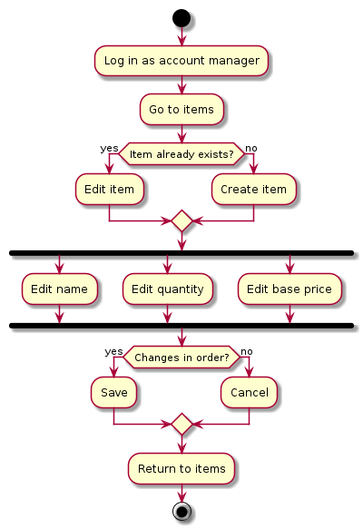

### Delete item
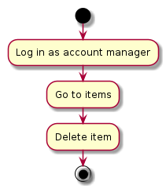

### Add items
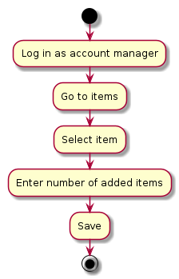

### Start a new special offer
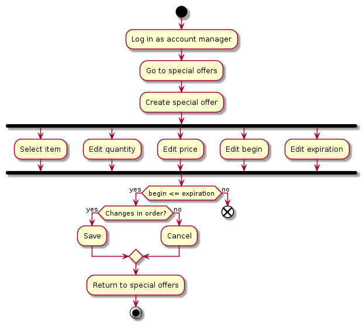

### Delete special offer
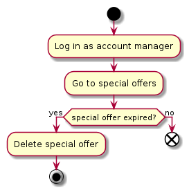

### Enter purchase
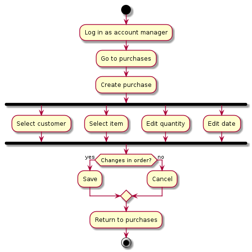

### Delete purchase
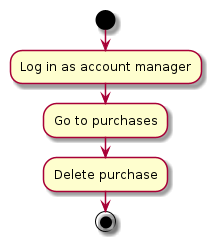