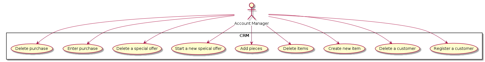
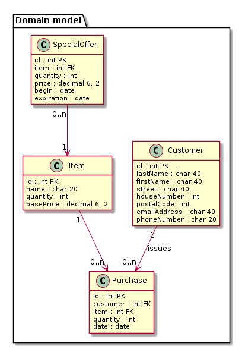

# CRM-System

## Project Vision Statement
I would like to develop a CRM system that provides the ability to easily manage customer data, items, special offers and purchases for free. 

## Project glossary

### Customer

A customer is a person who buys or has bought items from the application user. Street, house number, postal code, city, email address, phone number and purchases are recorded about him. Each customer has a consecutive id. 

### Item

An item is a product that the user offers for sale. It has a sequential id, a name and a base price. In addition, the number of available pieces is collected. 

### Special offer

A special offer is an offer in which a certain item is offered in a fixed quantity at a fixed, lower price for a limited period. Each offer has its own ID. 

### Purchase 

A purchase is an item that a customer wants to buy at a fixed time in a fixed quantity. It consists of a consecutive purchase number, the date, the customer, the item and the quantity. The price is the best price by using special offers. 

## Use-Case-Diagram

## User Stories

### Register a customer

As an account manager, I would like to be able to insert and edit new customers. 

I am logged in. I click on "Customers" in the navigation bar and get to a page where all customers are displayed. At each customer is a button "Edit". If I click on it, I will be able to edit the customer. If I click on the button with the "+" above the table, I can create a new customer. In both cases a form form appears where I can enter the data. When editing an already existing customer, his old data is entered there. If I click on the "Save" button below the form, the data is saved and I see the updated table. When I click the "Cancel" button, however, the change is discarded. 

### Delete a customer

As an account manager, I would like to delete customers that are no longer needed. 

When I am logged in, I click on "Customers" in the navigation. Then I see an overview of all my customers. If I click on "Delete" for a customer, the customer is deleted and I see the updated table. However, if there are still purchases of the customer (open), the deletion of the customer is not possible and an error message appears. 

### Create new item

As an account manager, I want to create a new item. 

When I am logged in, I click on "Items" and get to a page where all items are listed with the corresponding information. By clicking on "Edit" next to an item, I can edit the item. By clicking on the plus sign above the table I can create a new item. In both cases a form appears where I enter the name, the basic price in Dollar and the quantity. When editing an existing item, the old data is entered there at the beginning. By clicking on "Save" I save the changes and see the updated table. When I click the "Cancel" button, however, the change is discarded. The quantity of a new item has to be not negative and the price has to be at least 1 Cent. 

### Delete items
As an account manager, I would like to delete items from the database. 

When I am logged in, I click on "Items" and get to a table with all items. When I click on the "Delete" button for a particular item, the item is deleted aand I see the updated table. It is impossible to delete an item which is part of at least one purchase or has a special offer. 

### Add pieces
As an account manager, I would like to increase the quantity of an item. 

When I am logged in, I click on "Items" and get to a page with the list of all items. If I click on the plus sign for a certain item, a text field appears there where I can enter the number of pieces added. If I click on the button "Save" next to it, the number of pieces is updated. At the beginning, the text field contains the value 0, so that if I accidentally press the plus button, I can simply save without adding new pieces.  

### Start a new special offer
As an account manager, I want to launch special offers. 

When I am logged in, I click on "Special offers" and see a list with all special offers. If I click on "Edit" next to a special offer, I can edit it. If I click on the plus sign above the table, I can create a new special offer. In both cases a form appears where I can select the item and enter quantity, total price, beginning and expiration date. When I edit an already existing special offer, the old data is selected. The offer must be cheaper than buying the products separately, the special offer must not expire before it begins. The price must be greater or equal than 0.01 and the quantity must be at least 1. With "Save" the changes are saved and the recent date is used, with "Cancel" discarded. After that the current table is displayed.  

### Delete a special offer
As an account manager, I want to delete a special offer.

When I am logged in, I click on "Special offers" and see a list with all special offers. If I click on "Edit" next to a special offer, the special offer is deleted and the updated table is shown. However, if I want to delete an offer that has not yet expired, an error message appears instead. 

### Enter purchase
As an account manager, I would like to enter a new purchase. 

When I am logged in and click on "Purchases", I get a list with all purchases. If I click on the plus sign, a form opens. There I can select customers and items. I can also specify the quantity, but it must not be greater than the stock. Then I enter the date of the purchase. When I click on "Save", the purchase is inserted and the stock of the items is reduced according to the quantity. If I click on "Cancel", the changes are discarded. After that I see the current table. 

### Delete purchase
As an account manager, I would like to delete a purchase. 

When I am logged in and click on "Purchases", I see a list of all purchases. If I now click on the trash can next to an order, the order is deleted and the table is updated. However, this has no effect on the quantity of the item. 

## Domain model

## Activity diagrams

### Register a customer

### Delete a customer

### Create new item

### Delete item

### Add pieces

### Start a new special offer

### Delete special offer

### Enter purchase

### Delete purchase

# Technical details

MariaDB was used for this project. The project itself was written in TypeScript. On the server side Node.js was used. Express was used to set up the web server, Session was used for authentication and MySQL2 was used to access the database. On the client side, HTML, CSS and TypeScript were used; Bootstrap was used for design and Axios was used for communication with the server.

# Instructions for use

## Requirements

- Node.js with npm
- Database management system

## Installation

1. clone the repository
2. Import the SQL dump "CRMSystemDB.sql" into your database management system into the new created database "crmsystemdb". 
3. Run "npm install" in the cloned repository.

## Administrate account managers

The CRM system can be used only by registered account managers. This registration must be performed manually by the administrator via the database management system. For this purpose, a new entry must be created in the "accountmanager" table. The user name must be entered in the "username" column, and the password of the new user must be entered in "passwd". The value for "id" is set automatically. If the new user was successfully inserted, he/she can log in to the CRM system and use it. A user account can only be changed or deleted by the administrator via the database management system. 

## Use the app

First, start the database server. Then run node index.js in the repository. The app now runs on port 8080 and can be accessed by the user via a browser. The app uses cookies because this is necessary for user authentication. It is also necessary to enable JavaScript. 

## Disclaimer

This project was created in my spare time and is used to practice the above technologies. Therefore no attention was paid to legal aspects. I also do not assume any liability for possible legal violations caused by the use of the software. A productive use in the business world is therefore discouraged. If, however, there should be an interest in doing so, the IT and legal departments must examine this software and expand it if necessary. By using the app, you acknowledge that you have read this README.md and are willing to take full responsibility for the project.

## Developement

If you want to develop on the project, you must uncomment the import statements in the client-side .ts files so that the development environment does not display errors. However, when you run and test the app, you must comment out this line each time because the client cannot import modules and must reload them from the server instead.

It is also recommended to work with TypeScript and only change the .ts files. These can then be compiled with various tools (e.g. in the IDE).

